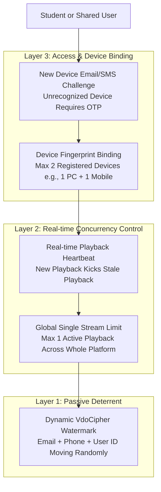

# Implementation Plan: Account & Password Sharing Prevention Strategy

## Goal Description
Prevent enrolled students from sharing their Technical Pilot LMS accounts and passwords with peers to access paid courses for free. The plan evaluates all industry-standard, feasible protection mechanisms, analyzes trade-offs, and provides a multi-layered implementation blueprint specifically tailored to the Technical Pilot architecture (NextAuth + NestJS + Supabase + VdoCipher DRM).

---

## 1. Vulnerability Analysis of Current System

Currently, several factors make account sharing easy for students:
1. **Static Passwords & No Login Verification**: Once Student A shares their password, Student B can log in immediately from any browser. The system sends an informational email, but does not challenge the new login with an OTP.
2. **Permissive Device Limit (`MAX_DEVICES_PER_USER = 2`)**: Two separate users can stay logged in simultaneously on two devices (e.g., Student A on Laptop 1, Student B on Laptop 2) without triggering any limit.
3. **Arbitrary Device Kickout**: When the 2-device limit is reached, anyone holding the password can pass `kickout_session_id` and kick out an existing device without authenticating via email/SMS.
4. **Per-Lesson Video Concurrent Check**: In [videos.service.ts](apps/api/src/features/videos/videos.service.ts#L475-L489), concurrent playback limits check `.eq('lesson_id', lessonId)` and allow `MAX_CONCURRENT_SESSIONS = 2`. Student A and Student B can watch different lessons simultaneously with zero conflict, and can even watch the same lesson at the same time.
5. **Generic Video Watermark**: The VdoCipher watermark currently renders static text: `"Technical Pilot. All rights reserved 2026."` ([videos.service.ts#L510-L517](apps/api/src/features/videos/videos.service.ts#L510-L517)). It does **not** display the student's email, phone number, or student ID. Consequently, students feel no risk of being identified if they screen-record or share accounts.

---

## 2. Evaluation of Feasible Prevention Strategies

Here is an objective comparison of the top feasible approaches used by major EdTech and exam platforms (Coursera, Udemy, PhysicsWallah, Allen, Unacademy):

| Strategy | How It Works | Deterrent Level | Student Friction | Implementation Effort |
| :--- | :--- | :--- | :--- | :--- |
| **A. Dynamic Forensic Watermark** | Overlays student's email, phone number, and IP address moving randomly across the video every 4-5 seconds. | **Very High (Psychological & Legal)** | **Zero (Seamless)** | **Very Low (< 1 day)** |
| **B. Global Single-Playback Enforcement** | Restricts video playback to strictly **1 active stream per user** portal-wide. Starting playback on Device B instantly terminates or blocks Device A. | **Very High (Stops simultaneous watching)** | **Low** (Legitimate users only watch 1 video at a time) | **Low (< 1 day)** |
| **C. Device Binding / Device Lock (1-2 Devices Max)** | Binds account to 1 or 2 specific hardware/browser fingerprints. Registering a new device requires a 30-day cooldown or admin approval. | **Extreme (Completely blocks other hardware)** | **Medium-High** (Students upgrading phones/PCs need resets) | **Medium (2-3 days)** |
| **D. New-Device Login OTP (2FA / Login Guard)** | Whenever a login originates from an unrecognized device/IP, require an OTP sent to the registered email/mobile. | **High (Sharing requires real-time OTP handoff)** | **Low-Medium** (Only prompts on new devices) | **Medium (2-3 days)** |
| **E. Single Active Session (Auto-Logout Previous Device)** | Only 1 active login session allowed. If Student B logs in, Student A is instantly logged out of their dashboard. | **Moderate-High** (Sharing causes annoying mutual logouts) | **Medium** (Students using both phone and laptop get logged out) | **Low (1 day)** |

---

## 3. Recommended Multi-Layered Architecture

A single measure is never 100% sufficient on its own. The best industry practice is a **3-Layer Defense** that balances ironclad security with a smooth student experience:

### Layer 1: Dynamic Forensic Watermarking (Immediate & High Impact)
- Configure VdoCipher's DRM `annotate` payload to stamp the student's **Email**, **Phone Number**, and **Student ID / IP** dynamically onto the video.
- Watermark bounces across different quadrants of the screen every 4-5 seconds with semi-transparency.
- **Why this works**: Students will **refuse to share** their password with friends or telegram groups because their personal phone number and email are visibly burned into the stream. If anyone screen-records or shares the video, the original student's identity is immediately exposed.

### Layer 2: Global Single-Playback Enforcement (Zero Concurrent Watching)
- Update `video_sessions` check from `eq('lesson_id', lessonId)` to **portal-wide**: `eq('user_id', userId)`.
- Set `MAX_CONCURRENT_SESSIONS = 1`.
- If Student B attempts to start a video on any lesson while Student A is watching, either:
  1. Student B is blocked with: *"Playback active on another device. Please pause the other stream to continue."*, OR
  2. Student A's stream is revoked immediately.
- This completely breaks account-sharing value: two students cannot study at the same time.

### Layer 3: Device Binding & New-Device Challenge
- Allow a student up to **2 registered devices** (e.g., 1 laptop/desktop and 1 smartphone/tablet).
- When a student signs in from a **new device**:
  - The system checks if the device fingerprint matches existing registered devices.
  - If it is a new device and the student already has 2 registered devices:
    - Block login and require either an automated **Device Reset Cooldown (e.g. 1 reset allowed every 30 days)** or **Admin Reset Request**.
  - If under the limit:
    - Send a **One-Time Passcode (OTP)** to the student's registered email before activating the new device.
    - Student A cannot easily share passwords with 5 friends because every friend needs Student A to check their email and provide an OTP.

---

## 4. Proposed Phased Implementation Plan

### Phase 1: Immediate Protection (No breaking UX changes)
1. **Dynamic Video Watermark**:
   - Update [videos.service.ts](apps/api/src/features/videos/videos.service.ts) to query the student's profile (`email`, `phone`, `full_name`).
   - Format VdoCipher annotation array with randomized coordinates, 4000ms interval, 40% opacity, rendering `student_email | student_phone`.
2. **Global Single-Stream Enforcement**:
   - Update `generateOtp` in [videos.service.ts](apps/api/src/features/videos/videos.service.ts) to enforce `MAX_CONCURRENT_SESSIONS = 1` globally across all lessons for the user, rejecting or rotating stale streams.
   - Reduce video session TTL from 15 minutes to 3-5 minutes, maintained via player heartbeat.

### Phase 2: Device Binding & New Device OTP Challenge
1. **Database Schema Update (`packages/supabase/migrations/022_device_binding.sql`)**:
   - Add `is_trusted` / `is_verified` boolean to `devices`.
   - Add `device_reset_available_at` timestamp to `profiles` (for self-serve cooldown).
   - Add table `device_login_challenges` (`id`, `user_id`, `device_fingerprint`, `otp_code`, `expires_at`, `verified_at`).
2. **API Auth Service Update**:
   - On `POST /auth/sign-in`:
     - If credentials are valid, check if the incoming device fingerprint is already in `devices` for this `user_id`.
     - If new device:
       - If user already has `MAX_DEVICES` (e.g. 2): return `DEVICE_LIMIT_EXCEEDED` with instructions on cooldown or contacting admin.
       - If under limit: generate 6-digit OTP, send via `MailService`, return `CHALLENGE_REQUIRED`.
   - Add `POST /auth/verify-device-otp`:
     - Validates OTP, binds the device, issues access/refresh tokens.
3. **Web UI Updates**:
   - Add Device Challenge modal / screen in [sign-in.form.tsx](apps/web/components/auth/form/sign-in.form.tsx) to accept the 6-digit email OTP.
   - Show enrolled students their registered devices on their profile with clear notices: *"Your account is registered to these 2 devices. Sharing credentials violates portal policies and may result in an immediate ban."*

---

## 5. User Review Required & Design Choices

> [!IMPORTANT]
> Before implementing, please review the following design decisions:

1. **Device Limit Policy**:
   - **Option 1 (Recommended - 2 Devices)**: Allow 1 Desktop/Laptop + 1 Mobile Device. (Prevents account sharing while accommodating modern study habits).
   - **Option 2 (Strict - 1 Device)**: Allow only 1 active device at any time. (Maximum security, but students cannot switch between phone and laptop without re-verifying).
2. **Handling Device Replacement**:
   - When a student legitimately buys a new phone or laptop:
     - **Self-service cooldown**: Allow them to deregister a device once every 30 days via email OTP.
     - **Admin approval only**: Require them to message support / submit a ticket to swap devices.
3. **Rollout Strategy**:
   - Should we roll out **Phase 1 (Dynamic Watermarking + Single Stream Limit)** first, followed by Phase 2 (Device OTP / Binding)?

---

## 6. Verification Plan

### Automated Tests
- Unit tests in `videos.service.spec.ts`:
  - Verify watermark payload contains student's email and phone.
  - Verify concurrent stream check blocks or revokes when 2nd video request is made for the same user across different lessons.
- Unit tests in `auth.service.spec.ts`:
  - Test new device challenge generation.
  - Test OTP verification and device binding limit enforcement.

### Manual Verification
1. Sign in with Account A on Browser 1, start Video 1.
2. Sign in with Account A on Browser 2, start Video 2 $\rightarrow$ Verify Browser 1 stream is blocked/terminated.
3. Inspect VdoCipher video player $\rightarrow$ Verify moving watermark displaying student's email and phone number.
4. Attempt login from a 3rd distinct browser/device $\rightarrow$ Verify device limit challenge or OTP prompt.
